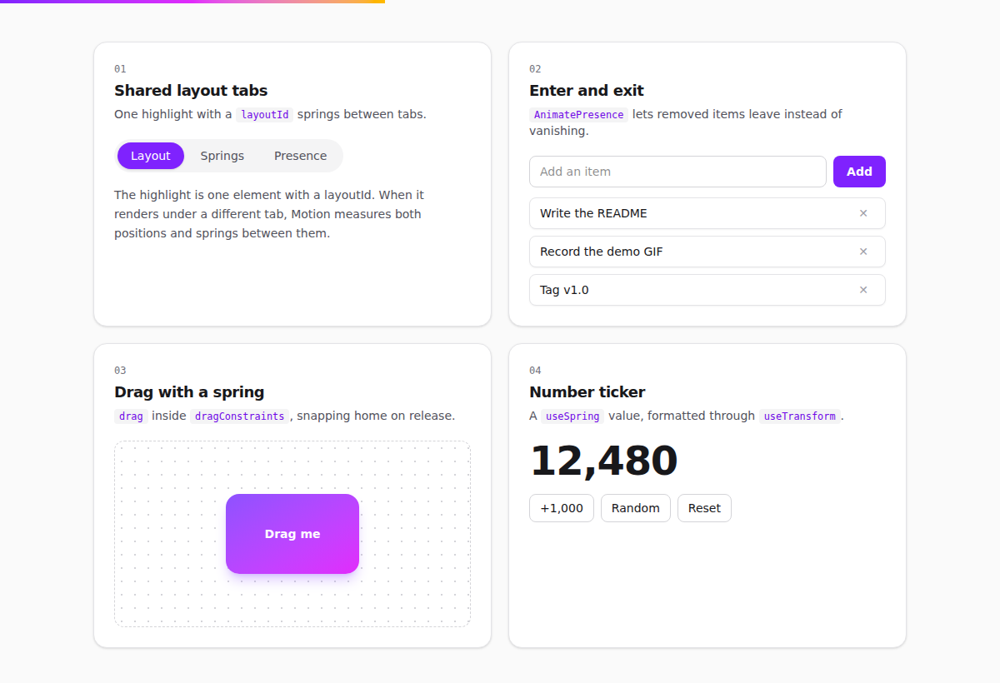

# UI Lab

[](https://github.com/umer-78/ui-lab/actions/workflows/ci.yml)


**Live:** https://umer-78.github.io/ui-lab/

Six animation patterns for React, built with [Motion](https://motion.dev). Each one
is a single file in [`src/demos/`](src/demos/), short enough to copy into another
project. Every pattern works with a keyboard, and all of them calm down when the
operating system asks for reduced motion.



## The patterns

| # | Pattern | File | The trick |
|---|---|---|---|
| 1 | Shared layout tabs | [`Tabs.tsx`](src/demos/Tabs.tsx) | One highlight with a `layoutId`; Motion springs it between tabs |
| 2 | Enter and exit | [`PresenceList.tsx`](src/demos/PresenceList.tsx) | `AnimatePresence mode="popLayout"`, so the rest of the list closes the gap while an item leaves |
| 3 | Drag with a spring | [`SpringCard.tsx`](src/demos/SpringCard.tsx) | `drag` inside `dragConstraints`, with `dragSnapToOrigin` |
| 4 | Number ticker | [`NumberTicker.tsx`](src/demos/NumberTicker.tsx) | `useSpring` for the value, `useTransform` for the formatting |
| 5 | Expanding rows | [`Accordion.tsx`](src/demos/Accordion.tsx) | `height: "auto"` plus `layout`, so the rows below move instead of jumping |
| 6 | Scroll progress | [`ScrollProgress.tsx`](src/demos/ScrollProgress.tsx) | `useScroll` into a spring-smoothed `scaleX` |

The cards themselves rise in once with `whileInView`, and the header staggers its
lines through variants, so adding a line needs no new delay.

## Keyboard and screen readers

Animation is the easy part; these are the parts that make it usable.

- **Tabs** use a roving `tabindex`: `←` `→` move and follow focus, `Home` and `End`
  jump, and each tab is wired to its panel with `aria-controls` / `aria-labelledby`.
- **Drag** has a keyboard route. Focus the card, move it with the arrow keys
  (clamped to the same bounds as dragging), and press `Escape` to send it home.
- **The ticker** hides the animating number from screen readers and announces only
  the settled value through a polite live region, not sixty numbers a second.
- **Expanding rows** keep `aria-expanded` in step with what is on screen.
- **Reduced motion** is one line: `<MotionConfig reducedMotion="user">` in
  [`main.tsx`](src/main.tsx) turns off transform and layout animation site-wide.

## How it is put together

```
src/lib/logic.ts   every decision that is not animation: tab keys, list ids,
                   number formatting, drag bounds. No React, no DOM.
src/demos/         one file per pattern
src/App.tsx        the page
src/Hero3D.tsx     loads the header's 3D scene after first paint, if WebGL is there
src/lib/labScene.ts  that scene: six panels, one per pattern, on springs; click one
                   to jump to its demo
src/test/          vitest + Testing Library
```

Two details the tests pin down:

- A removed item's id is never reused, because a repeated React key during an
  exit animation makes the leaving element and the new one fight over the DOM node.
- The ticker never shows `-0` while springing down to zero.

## Develop

Requires **Node.js 22**.

```bash
git clone https://github.com/umer-78/ui-lab.git
cd ui-lab
npm ci
npm run dev        # http://localhost:5173
npm test           # 15 tests
npm run typecheck
npm run build
```

## Adding a component from 21st.dev

The `@/` import alias that [21st.dev](https://21st.dev) and shadcn-style
components expect is already set up in `vite.config.ts` and `tsconfig.json`, so a
component can be dropped in with the 21st CLI:

```bash
npm i -g @21st-dev/cli
21st login
21st search "pricing table"
21st add <author>/<slug>
```

## Bundle size

Measured with `npm run build`: 122.84 kB of gzipped JavaScript for the page. React 19
and the full `motion` component make up most of it, which is fine for a gallery of
animations. The header's 3D scene is another 135.21 kB (three.js), split into its
own chunk and loaded only after the page has painted. For an app where animation is a detail rather than the point, load
Motion through `LazyMotion` instead, as
[task-board](https://github.com/umer-78/task-board) does.

## Deploy

Every push to `main` runs the tests and publishes `dist/` to GitHub Pages
([`.github/workflows/deploy.yml`](.github/workflows/deploy.yml)). The Vite `base`
is `/ui-lab/` for production builds only.

## Licence

MIT — see [LICENSE](LICENSE).
